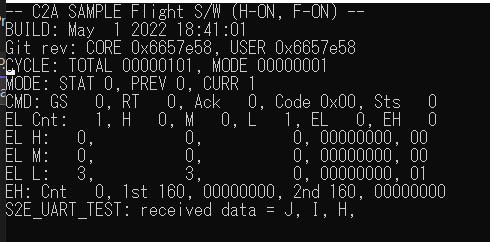

# How to integrate C2A

## 1.  Overview
- [C2A](https://gitlab.com/ut_issl/c2a) (Command Centric Architecture) is an architecture for spacecraft flight software developed by [ISSL](https://www.space.t.u-tokyo.ac.jp/nlab/index.html).
- S2E can optionally execute [C2A](https://gitlab.com/ut_issl/c2a) as a flight software for flight software development and debugging.
- This document describes how to integrate the C2A.
- You can find sample codes for this tutorial in `Tutorials/SampleCodes/C2A_Integration`.

## 2. How to build C2A in S2E
- C2A is basically written in C language, but S2E builds C2A in C++ language.
  - **Note** The character encoding of C2A is `JSIS` and is different with S2E's `UTF-8`
- When users want to use C2A, complete the following steps
  - Make `FlightSW` directory at same directory with `s2e_core_oss` and `s2e_user`.
  - Make a `c2a_user_oss` directory in `FlighSW` and clone a [C2A_USER repository](https://gitlab.com/ut_issl/c2a/c2a_user_oss) you want to use
    ```
    ├─FlightSW  
    │  └─ c2a_user_oss
    ├─s2e_core_oss
    └─s2e_user  
  - Edit `s2e_user/CMakeLists.txt`
    - `set(C2A_DIR ${FLIGHT_SW_DIR}/c2a_user_oss)` -> edit the directory name according with your situation
    - `set(USE_C2A OFF)` -> `set(USE_C2A ON)`
  - Build `s2e_user`
  -  **Note:** When you add a new C source file in C2A, you need to modify the `c2a_user_oss/CMakeLists.txt` directory to compile it in S2E.

## 3. How to execute C2A in S2E
- In the default setting of S2E, C2A is build but isn't executed. To execute the C2A, users need to implement the execution code.
- The sample code is in the `S2E_CORE_OSS/src/Component/CDH/OBC_C2A`.
  - In the `Initialize` function of OBC_C2A, all C2A initialize functions are called as follows.
  ``` cpp
  void OBC_C2A::Initialize()
  {
    #ifdef USE_C2A
    CA_initialize();            //Cmd Analyze
    TF_initialize();            //TLM frame
    PH_init();                  //Packet Handler
    TMGR_init();                //Time Manager
    AL_initialize();            //Anomaly Logger
    AM_initialize();            //App Manager
    AR_load_initial_settings();	//App Registry
    AM_initialize_all_apps();	  //App Managerに登録されてるアプリの初期化
    BCT_initialize();	          //Block Cmd Table
    MM_initialize();            //Mode Manager
    TDSP_initialize();          //Task Dispatcher
    WDT_init();                 // WDT
    #endif
  }
  ```
  - In the `MainRoutine` function of OBC_C2A, the time update function and task list execution functions are called as follows. The time update period of the function is 1msec
  ``` cpp
  void OBC_C2A::MainRoutine(int count)
  {
    #ifdef USE_C2A
    TMGR_count_up_master_clock();   //The update time oc C2A clock is 1msec
    TDSP_execute_pl_as_task_list();
    #endif
  }
  ```

- Users can use the `OBC_C2A` class in the `User_components` class same with other components.


## 4. Communication between C2A and S2E
- Generally, communication between flight software and S2E is executed via `OBC` class.
- The `OBC` base class has communication port and communication functions, and other components and flight software uses the communication port to communicate each other.
  ```cpp
  // Communication port functions
  virtual int ConnectComPort(int port_id, int tx_buf_size, int rx_buf_size);
  virtual int CloseComPort(int port_id);
  // OBC -> Components
  virtual int SendFromObc(int port_id, unsigned char* buffer, int offset, int count);
  virtual int ReceivedByCompo(int port_id, unsigned char* buffer, int offset, int count);
  // Components -> OBC
  virtual int SendFromCompo(int port_id, unsigned char* buffer, int offset, int count);
  virtual int ReceivedByObc(int port_id, unsigned char* buffer, int offset, int count);
  ```
- Components without the OBC can use the `SendFromCompo` and `ReceivedByCompo` for communication with the flight software. Driver functions in the flight software can use `SendFromObc` and `ReceivedByOBC` for communication with the components. It is important to use same `port_id`.
- However, C2A cannot directly use `SendFromObc` and `ReceivedByOBC` since it is basically written in C, and it is difficult to pass the `OBC` class as an argument to C2A. So `OBC_C2A` has static functions for C2A. 
  ```cpp
  // Static function for C2A
  static int SendFromObc_C2A(int port_id, unsigned char* buffer, int offset, int count);
  static int ReceivedByObc_C2A(int port_id, unsigned char* buffer, int offset, int count);
  ```
- In addition, because of the difference of character encoding, it is difficult to include S2E header files in C2A codes, so `OBC_C2A` also has the wrapper functions. `C2A` can communicate with components using the wrapper functions.
  ```cpp
  int OBC_C2A_SendFromObc(int port_id, unsigned char* buffer, int offset, int count);
  int OBC_C2A_ReceivedbyObc(int port_id, unsigned char* buffer, int offset, int count);
  ```
- Currently, the wrapper functions are used in [src_user/IF_Wrapper/SILS/RS422_SILS.c](https://gitlab.com/ut_issl/c2a/c2a_user_oss/-/blob/develop/SH7254R_C2A/src_user/IF_Wrapper/SILS/RS422_SILS.c). The `RS422_SILS` functions automatically overload the normal `RS422` functions when C2A is executed on the S2E. So users just use `RS422` functions for thier own embeded system.
- For other interfaces as I2C, SPI, and etc. will be implemented.

# 5. Sample codes for S2E-C2A communication
- S2E side
  - Users can use [EXP](https://gitlab.com/ut_issl/s2e/s2e_core_oss/-/blob/develop/src/Component/Abstract/EXP.h) class in `S2E_CORE_OSS` as a test component to communicate with C2A.
  - Add `EXP` as a component in `User_Component` with reference to the sample codes in `Tutorials/SampleCodes/C2A_Integration/S2E_src`.
  - Edit following parameters in `User_SimBase.ini` since the C2A's time update frequency is 1msec.
    ```
    StepTimeSec=0.001 //sec
    CompoUpdateIntervalSec = 0.001 //sec 
    ```
- C2A side
  - Edit `AppRegistry.c,h`, `rs422_dummy.c,h`, and `driver_update.c` with reference to the sample codes.
- Execution and Result
  - Please use `break point` feature to check that the communication between `EXP` and `RS422_dummy` works well.
    - The `RS422_dummy` sends capital alphabets from `A` to `Z` with `SET` command for `EXP`.
    - The `EXP` receives the command and store the received characters in the buffer and sends the buffer data to `RS422_dummy`.
    - Users can check the `RS422_dummy`'s received data (test_rx_data_) at the following break point.
    ```c
    // Receive
    RS422_RX(&rs422_dummy_ch_[test_ch], &test_rx_data_[0], 100);
    } //<- break point
    ``` 
  
  
