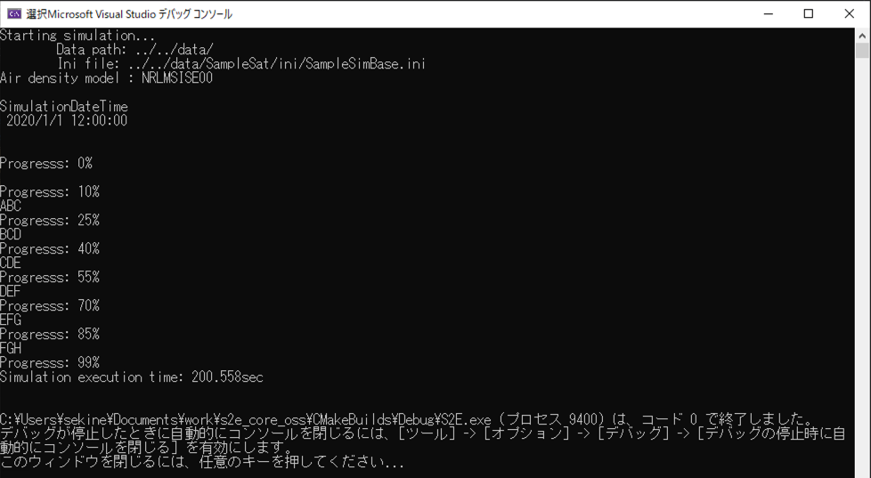

# How to Perform UART HILS Test

## 1.  Overview
- Using the [SerialPort Class](https://docs.microsoft.com/en-us/dotnet/api/system.io.ports.serialport?view=dotnet-plat-ext-5.0) in System.IO.Ports Namespace, you can perform serial communication from the COM port of your computer.
- The HILS test can be performed by replacing satellite components with simulated components in S2E.
- This document describes how to perform HILS Test with **UART** components.
   - If you want to perform HILS Test with **I2C** components, refer to [here](./HowToPerformI2cHilsTest.md).

## 2. How to build files for the HILS test
- **Currently, the HILS test is only available for Visual Studio users on Windows.**
- Serial port operations are written in `Interface/HilsInOut/Ports/HilsUartPort.cpp` in c++/cli language.
- When users want to execute the HILS test, complete the following steps.
  - Edit `s2e-core/CMakeLists.txt`
     - `set(USE_HILS OFF)` -> `set(USE_HILS ON)`
  - build `s2e-core`
- **Note**: Currently, breakpoints do not work if you build c++/cli and c++ files simultaneously.

## 3. Sample codes for UART communication
- The supported version of this document
  - s2e-core: [v4.0](https://github.com/ut-issl/s2e-core/releases/tag/v4.0)
- Hardware Settings
  - Set loopback connection of two USB-UART converters using two USB ports of your computer.
  - Check the COM port number for each connection.
  - This tutorial assumes the use of [USB-COMi-SI](https://www.titan.tw/product/usb-comi-si/), a USB-UART converter.
- Software Settings
   - `s2e-core/src/Component/Abstract/ExpHils.cpp` is an example of a simulation component for serial port communication.
   - `ExpHils` is instantiated in `s2e-core/src/Simulation/Spacecraft/SampleComponents.cpp`.
   - Uncomment as follows in `s2e-core/src/Simulation/Spacecraft/SampleComponents.cpp`.
   ```c++
  // UART tutorial. Comment out when not in use.
  exp_hils_uart_responder_ = new ExpHils(clock_gen, 1, obc_, 3, 9600, hils_port_manager_, 1);
  exp_hils_uart_sender_ = new ExpHils(clock_gen, 0, obc_, 4, 9600, hils_port_manager_, 0);
   ```
   ```c++
  delete exp_hils_uart_responder_;
  delete exp_hils_uart_sender_;
   ```
    - Edit the constructor's argument based on the COM port number checked above.
      - The fourth argument of ExpHils constructor is COM port number.
    - Uncomment as follows in `s2e-core/src/Simulation/Spacecraft/SampleComponents.h`.
   ```c++
  ExpHils* exp_hils_uart_responder_;
  ExpHils* exp_hils_uart_sender_;
   ```
   - For the HILS test, edit the setting of simulation speed in `s2e-core/data/SampleSat/ini/SampleSimBase.ini`.
   ```ini
   // Simulation speed. 0: as fast as possible, 1: real-time, >1: faster than real-time, <1: slower than real-time
   SimulationSpeed = 1
   ```

- Execution and Result
  - There are two ExpHils components, a sender component and a responder component.
    - The sender component sends out a new message like `ABC`, `BCD`, ....
    - The responder component returns the message as received.
    - Data returned from the responder to the sender is output to the console.
  - If the comment `Error: the specified step_sec is too small for this computer.` appears, set `StepTimeSec` in SampleSimBase.ini to a larger value.