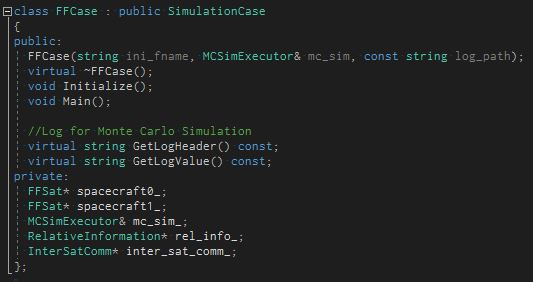
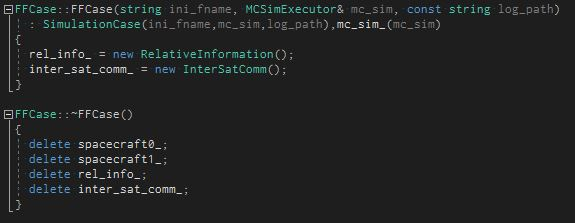
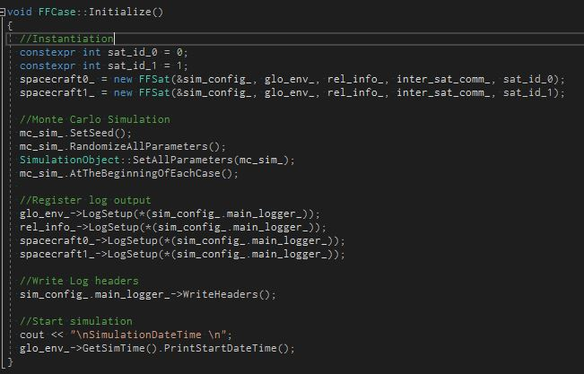
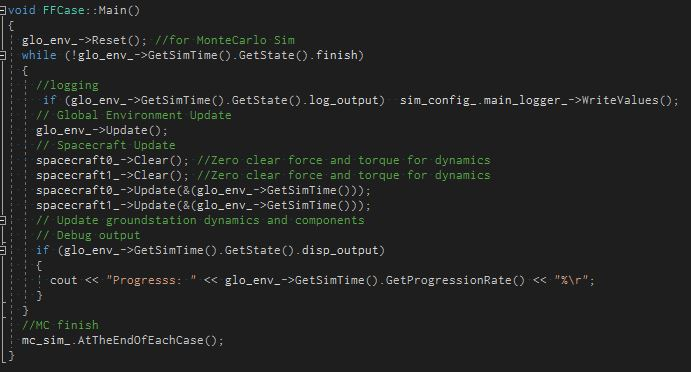

# How to simulate multiple satellites

## 1.  Overview
- S2E can simulate multiple satellites.
- This document describes how to simulate multiple satellites.
- The features of multiple satellite simulation are:
  + Relative dynamics information is logged automatically
  + Intersat communication can be used
  + Orbits can be propagated using relative dynamics theory.
- You can find sample codes for this tutorial in [S2E_FF](https://gitlab.com/ut_issl/s2e/s2e_ff) repository (Currently, this is private repository).

## 2. How to add a new satellite
1. Edit `ini` files
   1. Add `ini` files for the new satellite.
      - `Sat.ini`, `Disturbance.ini`, `LocalEnvironment.ini`, `Structure.ini` are needed.
   2. Register the ini file for the new satellite in `Simbase.ini`
      - The arguments of `sat_file` are used as satellite ID in simulation.
        ```
        [SIM_SETTING]
        sat_file(0)            = ../../data/ini/Sat0.ini
        sat_file(1)            = ../../data/ini/Sat1.ini
        ```

2. Edit source code
    1. Add `Satellite`, `RelativeInformation`, `InterSatComm` instances to `Case` members.
        <div align="center">
        
        </div>

    2. Edit constructor and destructor of `Case`.
        <div align="center">
        
        </div>

    3. Instantiate the spacecraft and set up logs for `spacecraft`s, `rel_info`.
        - NOTE: Do not forget to include `rel_info` and `inter_sat_comm` in the argument of the satellite constructor. (The constructor that does not need `rel_info` and `inter_sat_comm` is used for single satellite simulation.)
        <div align="center">
        
        </div>

    4. Add Spacecraft update function into the main function in `Case.cpp`.
        <div align="center">
        
        </div>
