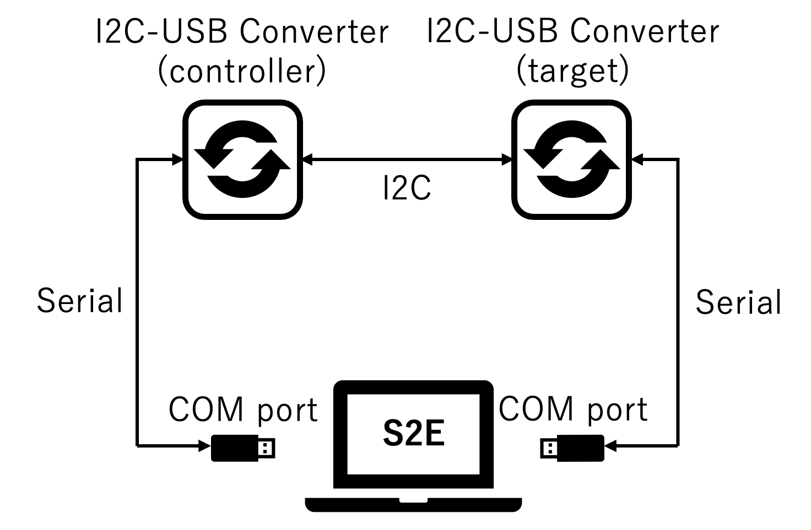
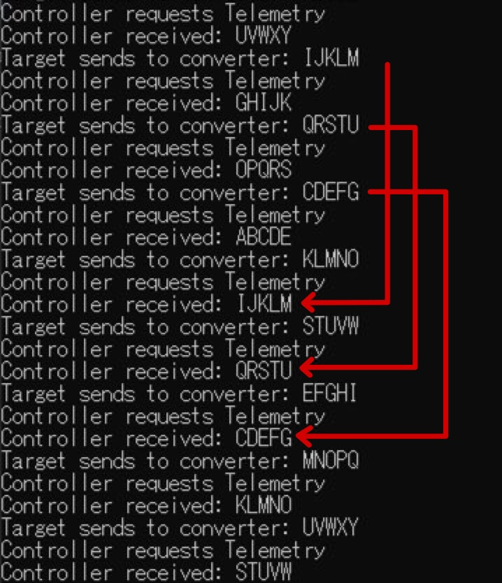

# How to use serial port communication

## 1.  Overview
- Using the [SerialPort Class](https://docs.microsoft.com/en-us/dotnet/api/system.io.ports.serialport?view=dotnet-plat-ext-5.0) in System.IO.Ports Namespace, you can perform serial communication from the COM port of your computer.
- The HILS test can be performed by replacing satellite components with simulated components in S2E.
- This document describes how to use serial port communication.

## 2. How to build files for the HILS test
- **Currently, the HILS test is only available for Visual Studio users on Windows.**
- Serial port operations are written in `Interface/HilsInOut/Ports/HilsUartPort.cpp` in c++/cli language.
- When users want to execute the HILS test, complete the following steps.
  - Edit `s2e-core/CMakeLists.txt`
  - `set(USE_HILS OFF)` -> `set(USE_HILS ON)`
  - build `s2e-core`
- **Note**: Currently, breakpoints do not work if you build c++/cli and c++ files simultaneously.

## 3. Sample codes for UART communication
- The supported version of this section
  - s2e-core: [v4.0](https://github.com/ut-issl/s2e-core/releases/tag/v4.0)
- Hardware Settings
  - Set loopback connection of two USB-UART converters using two USB ports of your computer.
  - Check the COM port number for each connection.
  - This tutorial assumes the use of [USB-COMi-SI](https://www.titan.tw/product/usb-comi-si/), a USB-UART converter.
- Software Settings
   - `s2e-core/src/Component/Abstract/ExpHils.cpp` is an example of a simulation component for serial port communication.
   - `ExpHils` is instantiated in `s2e-core/src/Simulation/Spacecraft/SampleComponents.cpp`.
   ```c++
  // Examples of HILS
  exp_hils_uart_responder_ = new ExpHils(clock_gen, 1, obc_, 3, 9600, hils_port_manager_, 1);
  exp_hils_uart_sender_ = new ExpHils(clock_gen, 0, obc_, 4, 9600, hils_port_manager_, 0);
   ```
   - Edit the constructor's argument based on the COM port number checked above.
     - The fourth argument of ExpHils constructor is COM port number.
   - For the HILS test, edit the setting of simulation speed in `s2e-core/data/SampleSat/ini/SampleSimBase.ini`.
   ```ini
   // Simulation speed. 0: as fast as possible, 1: real-time, >1: faster than real-time, <1: slower than real-time
   SimulationSpeed = 1
   ```

- Execution and Result
  - There are two ExpHils components, a sender component and a responder component.
    - The sender component sends out a new message like `ABC`, `BCD`, ....
    - The responder component returns the message as received.
    - Data returned from the responder to the sender is output to the console.
  - If the comment `Error: the specified step_sec is too small for this computer.` appears, set `StepTimeSec` in SampleSimBase.ini to a larger value.

## 4. Sample codes for I2C communication
- The SerialPort class can also be used to perform HILS tests on simulated I2C components. It is assumed that USB-I2C converters will be used and that serial communication will be performed between the COM port and the converter.
- The supported version of this section
  - s2e-core: the latest develop
- Hardware Settings
  - Set loopback connection of a USB-I2C controller converter and a USB-I2C target converter using two USB ports of your computer.
  - Check the COM port number for each connection.
  - This tutorial assumes the use of [SC18IM700](https://www.nxp.com/docs/en/data-sheet/SC18IM700.pdf), a USB-I2C Controller converter and [MFT200XD](https://www.ftdichip.com/Support/Documents/DataSheets/ICs/DS_FT200XD.pdf), a USB-I2C Target converter.
  - **Note** Loopback is not always necessary. Only one of the I2C controller or the I2C target can be simulated in S2E. In a general HILS configuration, the I2C controller is an OBC. s2e-core provides a simulated component of the I2C controller in order to validate the simulated component of the I2C target.
- Software Settings
   - `s2e-core/src/Component/Abstract/ExpHilsI2cController.cpp` and `s2e-core/src/Component/Abstract/ExpHilsI2cTarget.cpp` are examples of simulation components for I2C communication.
   - `ExpHilsI2cController` and `ExpHilsI2cTarget` are instantiated in `s2e-core/src/Simulation/Spacecraft/SampleComponents.cpp`.
   ```c++
  exp_hils_i2c_controller_ = new ExpHilsI2cController(clock_gen, 5, 115200, hils_port_manager_);
  exp_hils_i2c_target_ = new ExpHilsI2cTarget(clock_gen, 0, 0x44, obc_, 6, hils_port_manager_);
   ```
   - Edit the constructor's argument based on the COM port number checked above.
   - Edit the baud rate and I2C address according to the converter and simulation conditions.
   - For the HILS test, edit the setting of simulation speed in `s2e-core/data/SampleSat/ini/SampleSimBase.ini`.
   ```ini
   // Simulation speed. 0: as fast as possible, 1: real-time, >1: faster than real-time, <1: slower than real-time
   SimulationSpeed = 1
   ```

- Execution and Result
  - There are two components, an I2C controller component and an I2C target component.
  - I2C controller
    - Send a command to the I2C target.
      - Send a command to request a telemetry. 1 byte register address is sent to specify the first address of the data to be read from the I2C controller.
      - Send a command to read a telemetry from the USB-I2C target converter.
  - I2C target
    - Receive commands from the I2C controller and send telemetry to the I2C controller.
      - After receiving the telemetry request command, send the telemetry (like ABCDE, BCDEF, ...) to the USB-I2C target converter.
  - **Note** Currently, the latency from the time the USB-I2C target converter receives the data via I2C communication to the time it is sent to the I2C target component via serial communication is too long, at least 1ms, making it impossible to immediately respond to telemetry request commands.
    - Three frames of telemetry are stored in the USB-I2C target converter in advance.
    - Each time the I2C controller reads the telemetry stored in the USB-I2C target converter, the I2C target component adds the telemetry to the USB-I2C target converter.
  -  The data sent by the I2C target and the data received by the I2C controller are the outputs to the console. Since there are three frames accumulated in the USB-I2C target converter, the I2C controller receives telemetry sent three cycles before from the I2C target.
  - If the comment `Error: the specified step_sec is too small for this computer.` appears, set `StepTimeSec` in SampleSimBase.ini to a larger value.